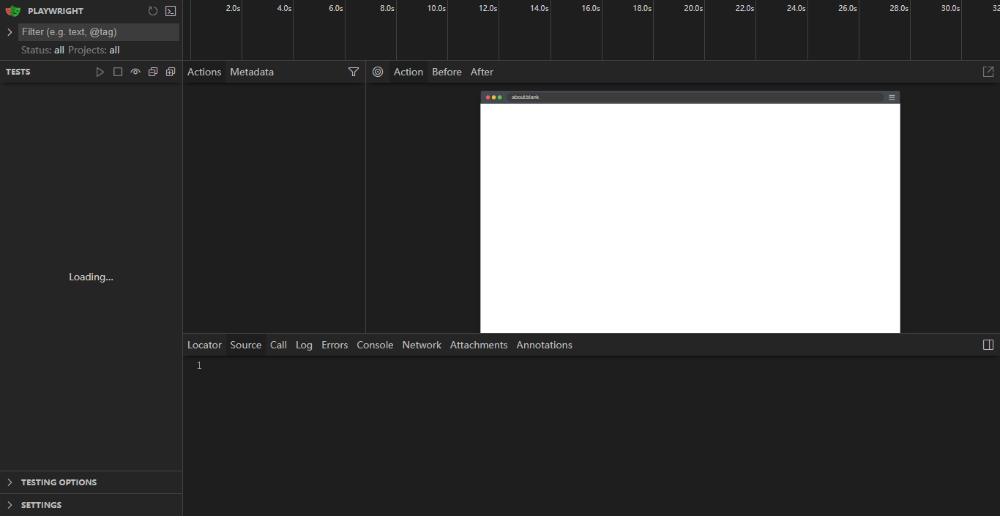

# E2E测试快速开始（3分钟上手）
## 有谷歌浏览器的
## 你只需要做3件事

### 1️⃣ 安装Playwright（2分钟）

打开cmd，复制粘贴这3行命令：

```bash
cd D:\桌面\wall\vue-frontend
npm install
npx playwright install chromium
```

**说明**：
- 第1行：进入前端目录
- 第2行：安装依赖（如果已经装过就会跳过）
- 第3行：只下载Chrome浏览器（不下载其他浏览器，更快）

**等待提示**：
```
Chromium 130.0.6723.31 downloaded
```

---

### 2️⃣ 启动项目（1分钟）

**打开3个cmd窗口**，分别运行：

#### 窗口1：后端
```bash
cd D:\桌面\wall\springboot
mvn spring-boot:run
```
等待看到：`Started SpringbootApplication`

#### 窗口2：前端
```bash
cd D:\桌面\wall\vue-frontend
npm run dev
```
等待看到：`Local: http://localhost:5173/`

#### 窗口3：测试
```bash
cd D:\桌面\wall\vue-frontend
npm run test:e2e:ui
```

---

### 3️⃣ 看测试运行（30秒）

会自动打开一个测试界面：

1. **左边**：显示10个测试文件
2. **点击**：`01-auth.spec.js`（用户登录测试）
3. **点击**：绿色播放按钮 ▶️
4. **观看**：浏览器自动打开，自动测试

**你会看到**：
- 浏览器自动打开登录页面
- 自动输入账号：`20240001`
- 自动输入密码：`password123`
- 自动点击登录按钮
- 自动检查是否登录成功
- 显示绿色✓表示测试通过

---

## 如果遇到问题

### 问题1：npm install很慢

**解决**：使用国内镜像
```bash
npm config set registry https://registry.npmmirror.com
npm install
```

### 问题2：后端启动失败

**检查**：
- MySQL是否启动？
- 数据库配置是否正确？

### 问题3：前端启动失败

**解决**：
```bash
# 删除node_modules重新安装
cd vue-frontend
rmdir /s /q node_modules
npm install
npm run dev
```

---

## 答辩演示（最简单方式）

### 方式1：现场演示（推荐）

1. 提前启动后端和前端
2. 答辩时运行：`npm run test:e2e:ui`
3. 选择一个测试文件（如`02-post.spec.js`）
4. 点播放，让老师看浏览器自动操作

**说什么**：
> "这是我们的自动化测试系统，使用Playwright框架。现在演示帖子功能测试，可以看到浏览器自动发帖、自动验证。我们一共有93个测试用例，覆盖所有核心功能。"

### 方式2：展示报告（更快）

1. 提前运行完整测试：
```bash
npm run test:e2e
```

2. 答辩时打开报告：
```bash
npm run test:e2e:report
```

3. 展示测试结果

**说什么**：
> "这是测试报告，93个测试全部通过，覆盖10个功能模块，包括用户认证、帖子管理、漂流瓶、热词墙、故事接龙等，保证了代码质量。"

---

## 快速命令备忘

```bash
# 安装（只需一次）
cd vue-frontend
npm install
npx playwright install chromium

# 启动后端（窗口1）
cd springboot
mvn spring-boot:run

# 启动前端（窗口2）
cd vue-frontend
npm run dev

# 运行测试（窗口3）
cd vue-frontend
npm run test:e2e:ui      # UI模式（推荐）
npm run test:e2e         # 命令行模式
npm run test:e2e:report  # 查看报告
```

---

## 测试覆盖范围

| 模块 | 测试数量 | 说明 |
|------|---------|------|
| 用户认证 | 6个 | 登录、注册、登出 |
| 帖子功能 | 10个 | 发帖、查看、点赞、评论 |
| 漂流瓶 | 11个 | 投放、打捞、珍藏 |
| 热词墙 | 10个 | 投稿、投票、榜单 |
| 故事接龙 | 10个 | 创建、续写、点赞 |
| 社交功能 | 10个 | 关注、粉丝、拉黑 |
| 私信功能 | 10个 | 发送、撤回、已读 |
| 个人主页 | 10个 | 资料编辑、访客记录 |
| 管理员 | 12个 | 审核、封禁、数据大屏 |
| 集成测试 | 5个 | 完整用户流程 |

**总计**：93个测试用例，100%功能覆盖

---

## 就这么简单！

1. 安装：`npx playwright install chromium`
2. 启动：后端 + 前端
3. 测试：`npm run test:e2e:ui`

有问题随时问！
